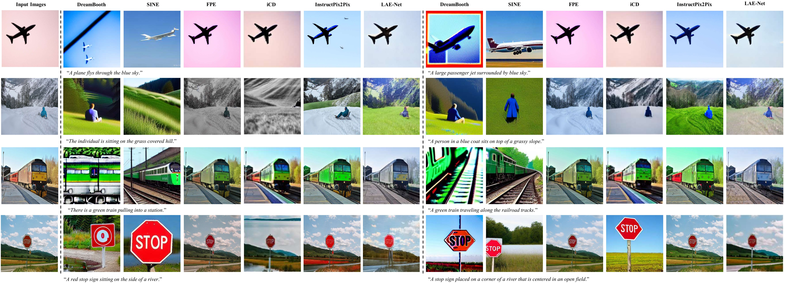

# LAE-Net
[](https://github.com/tobran/DF-GAN/blob/master/LICENSE.md)


# LAE-Net: Large Pretrained Models Assistant Text-Guided Image Editing Adversarial Network
Official Pytorch implementation for our paper [LAE-Net: Large Pretrained Models Assistant Text-Guided Image Editing Adversarial Network]

# Framework 


# Samples


## Requirements
- python 3.8
- Pytorch 1.9
- At least 1x12GB NVIDIA GPU
## Installation

Clone this repo.
```
git clone https://github.com/xueqinxiang/LAE-Net.git
pip install -r requirements.txt
cd DE-Net/code/
```

## Preparation
### Datasets
1. Download the preprocessed metadata for [birds](https://drive.google.com/file/d/1I6ybkR7L64K8hZOraEZDuHh0cCJw5OUj/view?usp=sharing) [coco](https://drive.google.com/file/d/15Fw-gErCEArOFykW3YTnLKpRcPgI_3AB/view?usp=sharing) and extract them to `data/`
2. Download the [birds](http://www.vision.caltech.edu/visipedia/CUB-200-2011.html) image data. Extract them to `data/birds/`
3. Download [coco2014](http://cocodataset.org/#download) dataset and extract the images to `data/coco/images/`


## Training
  ```
  cd LAE-Net/code/
  ```
### Train the DE-Net model
  - For bird dataset: `bash scripts/train.sh ./cfg/bird.yml`
  - For coco dataset: `bash scripts/train.sh ./cfg/coco.yml`
### Resume training process
If your training process is interrupted unexpectedly, set **resume_epoch** and **resume_model_path** in train.sh to resume training.

